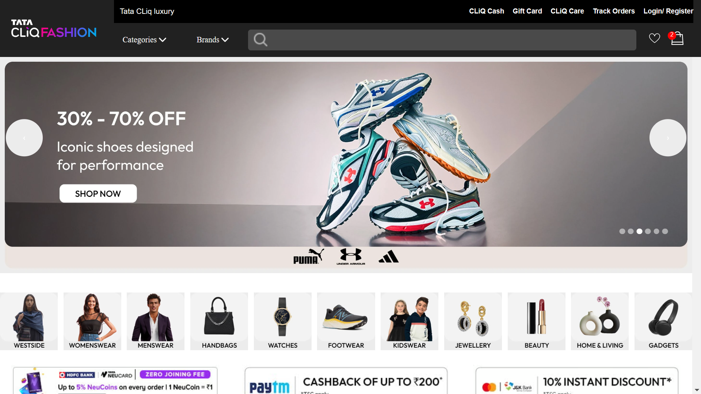
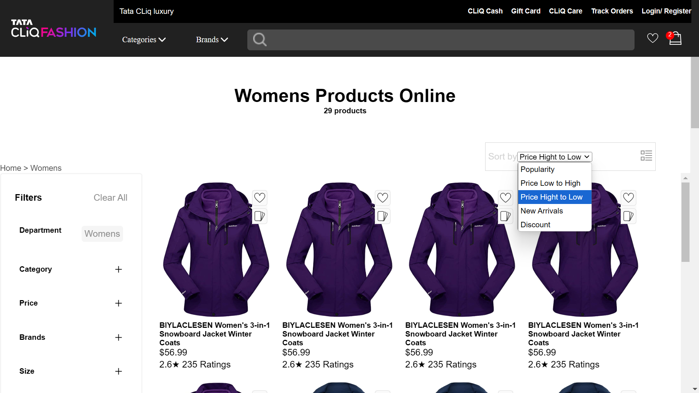
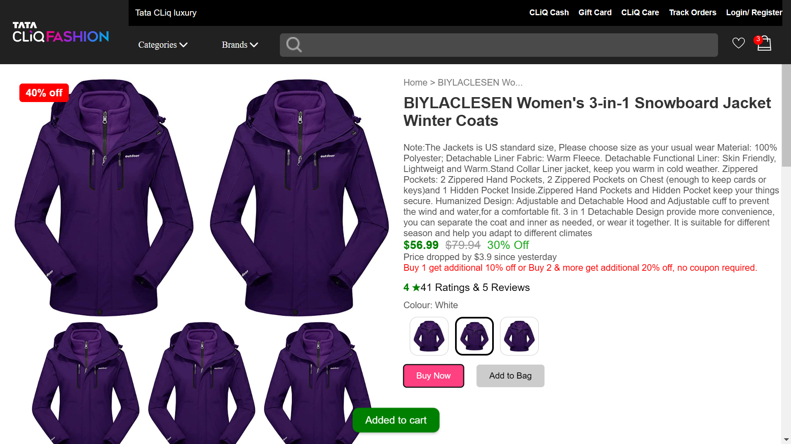
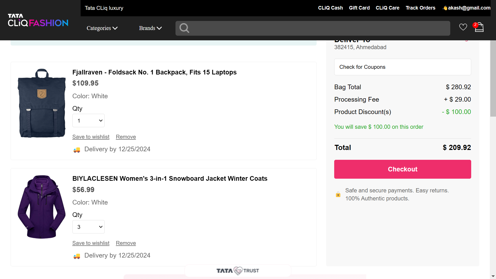

# TataCLiQ 

## Project Overview
This project is a single-page e-commerce website built using React. The website provides a streamlined shopping experience with essential features designed to improve user interaction and engagement.





## Features
- **User Authentication:** 
  - Signup and Login form displayed as a modal with a blurred background for an improved user experience.
  - Using local storage with json server
- **Product Listing:** 
  - Displays a variety of products with dynamic data.
    - Mens wear
    - Womens wear
    - Jewelry 
    - Gadgets Den

 - Products are presented in a responsive grid layout.
- **Product Details:** 
  - Clicking on a product shows detailed information about it.
- **Add to Cart:** 
  - Users can add items to their cart and view the cart summary.
  - While checkout user get logoff then auth will actice and cant place the order. 


## Technologies Used
- **Frontend:** React (with hooks and functional components)
- **Styling:** CSS for custom designs
- **Routing:** React Router DOM v6.4+
- **State Management:** React Context API
- **Backend/Server:** Bun for development server and module bundling
- **API:** Axios for making API requests 
- **API:** JSON Server - 100 Products

## Installation and Setup
1. Clone the repository:
   ```bash
   Hit the URL : `https://github.com/masai-course/akash_cap01_051/tree/master/Coding%20Platform/Dec/Project/TataCLiQ`
   ```
2. Navigate to the project directory:
   ```bash
   cd TataCLiQ
   ```
3. Install dependencies using Bun:
   ```bash
   $ bun install
   ```
4. Start the development server:
   ```bash
   bun dev
   $ bun json-server db.json
   ```
5. Open your browser and navigate to:
   ```
   http://localhost:3000
   ```

## Project Structure
```

|-- API/
|   |-- api.jsx
|   |-- getMoreDetails.jsx
|
|-- Auth/
|   |-- AuthProvider.jsx
|
|-- Cart/
|   |-- CartProvider.jsx
|
|-- Layout/
|   |-- AppLayout.jsx
|   |-- Footer.jsx
|   |-- Header.jsx
|   |-- Lower_NavBar_Panel.jsx
|   |-- NAVBAR_DATA.jsx
|
|-- UI/
|   |-- Main--Component.jsx
|   |-- QuickLinks.jsx
|   |-- TopSlideBar.jsx
|
|-- Pages/
|-- App.css
|-- App.jsx
|-- IMPORT_EXPORT.jsx
|-- index.css
|-- Links.js
|-- main.jsx
|-- ProtectedRoute.jsx
```


## Learnings
- Gained hands-on experience with React Router DOM (v6.4+), especially loaders and actions.
- Learned how to use Axios for API calls.
- Improved CSS skills, particularly in creating hover effects and responsive layouts.
- Got comfortable working with modals and their integration in React.

## Future Improvements
- Add a search bar to filter products dynamically.
- Implement user profile pages with order history.
- Integrate a payment gateway for a complete shopping experience.
- Enhance the cart functionality to save items even after a page reload.

## Author
- **[AKash]**

## Acknowledgments
- Special thanks to my commerce professor for inspiring me to push beyond my limits.

---

Feel free to suggest improvements or report issues in this project. Thank you for reviewing!
